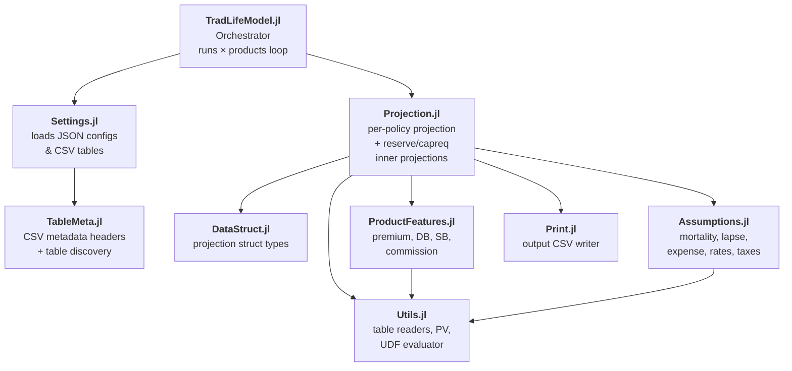
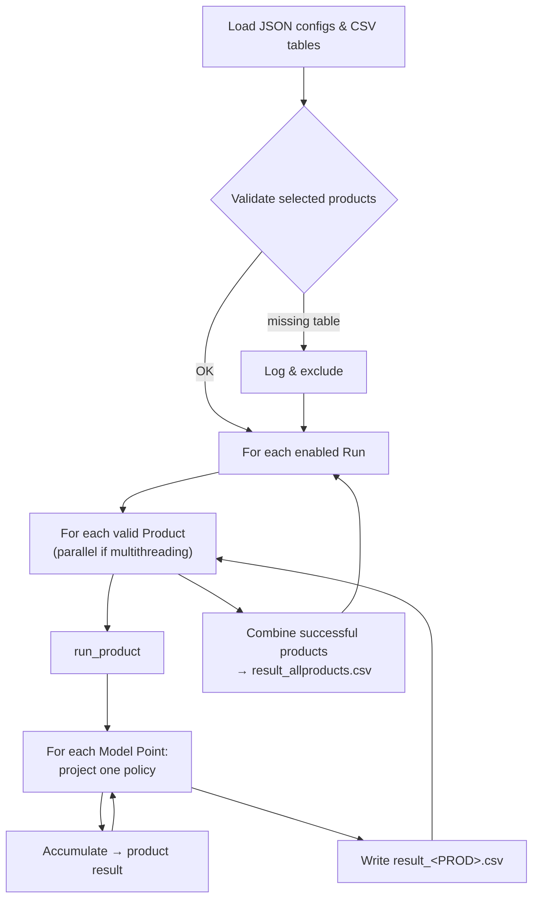
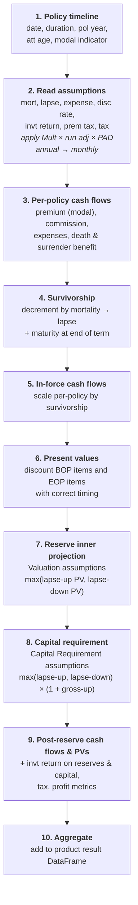
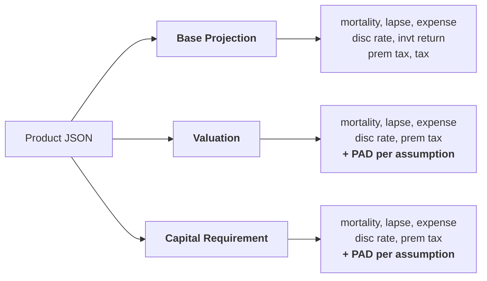

# TradLifeModel

TradLifeModel is a Julia-based actuarial modelling tool for traditional life 
insurance products that ships with a Genie-based web UI for configuration 
and monitoring, and can also be run directly from the command line.


## Installation

Install Julia from <https://julialang.org/downloads/>, then from the project root:

```bash
julia --project=. -e 'using Pkg; Pkg.instantiate()'
```


## Running

**Web UI** — from the project root:

```bash
cd app
julia --project=.. app.jl
```

Then open <http://localhost:8888>.

**CLI** (equivalent to clicking **Run Model** on the Run Monitor page):

```bash
cd src
julia --threads auto --project=.. TradLifeModel.jl
```

Output lands in `Output/<yyyy-mm-dd_HHMMSS>/<Run>/`. Each timestamped folder is one
**invocation** — one press of Run Model or one CLI command — and contains one subfolder
per enabled run (`Run01/`, `Run02/`, ...), each holding the per-product result CSVs.

Configuration (tables, products, runs, general settings) is done through the UI or by
editing JSON files under `Input/`.


## Repository layout

```
TradLifeModel/
├── Input/
│   ├── Products/PROD*.json       Per-product feature and assumption config
│   ├── Tables/*.csv              Product feature / assumption tables (with metadata headers)
│   ├── general_settings.json     Global run parameters
│   ├── print_option.json         Selects which result columns are written
│   ├── run_settings.json         Named runs with assumption adjustments
│   └── table_type_defn.json      Table type schema
├── MP/mp_<PROD>.csv              Model point files (one per product)
├── Output/<timestamp>/           Timestamped run outputs (one folder per invocation)
├── app/                          Genie web UI
│   ├── app.jl                    Server entry (port 8888)
│   ├── pages/*.jl                One module per page
│   └── public/{css,js}/          Static assets
└── src/                          Julia model source
    ├── Assumptions.jl            Reads mortality, lapse, expense, rates, taxes
    ├── DataStruct.jl             Projection struct types
    ├── Print.jl                  Output CSV writer
    ├── ProductFeatures.jl        Premium, death benefit, surrender benefit, commission
    ├── Projection.jl             Per-policy projection + reserve/capreq inner projections
    ├── Settings.jl               Loads JSON configs and CSV tables
    ├── TableMeta.jl              CSV metadata headers and table discovery
    ├── TradLifeModel.jl          Runs × products loop (entry point)
    └── Utils.jl                  Table readers, PV utility, UDF evaluator
```


## Architecture


### File map




### End-to-end execution flow




### How a policy is projected

Every month-indexed array is 0-based: index `0` = valuation date, index `t` = `t` months
into the projection. The horizon is fixed at 120 years.



For the first model point in each product, `Print.jl` also writes
`firstmpresult_<PROD>.csv` + `firstmpresult_innerproj_*.csv` (4 scenarios, for reconciliation).


### Three assumption sets per product

Every product configuration carries three assumption sets that reference shared tables. 
Base Projection drives the primary cash flow; Valuation and Capital Requirement drive
inner projections.



PAD is multiplicative for mortality / lapse / expense and additive for discount rate.


### Multiplicative vs additive run adjustments

Run Settings adjustments overlay on top of the product-level configuration:

- **Mortality, lapse, expense** — multiplicative (base = `1`; `1.1` = +10% stress)
- **Discount rate, investment return** — additive shifts in decimal units
  (base = `0`; `-0.01` = −100 bps)

Effective rate =  `table × product_mult × run_adjustment` (multiplicative) or
`table × product_mult + run_adjustment` (additive).


### User-defined formulas

Product features (premium, death benefit, surrender benefit, commission) can be specified
as a formula string over the columns of a user-defined table. Formulas are parsed once to
a Julia `Expr` and walked by a restricted evaluator that supports only
`+  −  *  /  ^  %` plus `min` / `max`.


### Table discovery and validation

Each CSV in `Input/Tables/` starts with `#Table Type`, `#Table Category`,
`#Table Details` comment lines. On startup, these headers are scanned and validated
against `Input/table_type_defn.json`; unrecognised or malformed files are skipped with a
warning. Before any run starts, each selected product is checked for unresolved table
references — products with missing tables are excluded from the invocation and logged.


### Multithreading and error isolation

Runs are looped sequentially; products within a run execute in parallel Julia tasks when
multithreading is enabled and Julia is started with more than one thread. Log writes are
serialised through a lock. If a single product fails, its stack trace is captured in
`run_log.txt`, that product is excluded from the run's combined result, and all other
products and runs continue.


## Output files (per run)

| File | Contents |
|---|---|
| `result_<PROD>.csv` | Portfolio aggregates by month for one product |
| `result_allproducts.csv` | Sum across successful products in the run |
| `firstmpresult_<PROD>.csv` | Full per-column detail for the first model point |
| `firstmpresult_innerproj_<scenario>_<PROD>.csv` | Inner projection detail (lapse-up / lapse-down for reserve & capreq) |
| `run_log.txt` | Invocation-level log (validation, per-product failures, timings) |

Column selection is controlled by `Input/print_option.json` — variables can be toggled on
and off without changing code.